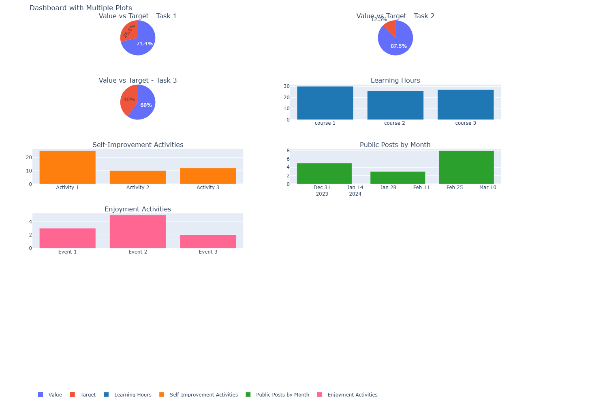

# KPI Visualizer 📊

This project is a KPI (Key Performance Indicator) visualizer using Python, Plotly, and Pandas. The script reads data from an Excel file and generates a dashboard with multiple subplots to visualize various KPIs.

## 🚀 Features

- Load data from an Excel file 📄
- Visualize value vs. target for multiple tasks using pie charts 🎯
- Visualize learning hours, self-improvement activities, public posts by month, and enjoyment activities using bar charts and pie charts 📈
- Scrollable and non-overlapping design 🔄
- Legends with colors for easy identification 🌈

## 🛠️ Installation

1. **Clone the Repository:**
   ```sh
   git clone https://github.com/yourusername/KPI-Visualizer.git
   cd KPI-Visualizer
   ```

2. **Install Dependencies:**
   Make sure you have Python installed. You can use pip to install the required packages.
   ```sh
   pip install pandas plotly openpyxl
   ```

## 🎯 Usage

1. **Prepare Your Excel File:**
   Ensure your Excel file (`kpi_data_dashboard.xlsx`) is formatted as follows:

   ### Tasks Sheet
   | Column  | Description         |
   |---------|---------------------|
   | Task    | Name of the task    |
   | value   | Current task value  |
   | target  | Target task value   |

   Example:
   | Task  | value | target |
   |-------|-------|--------|
   | Task1 | 30    | 50     |
   | Task2 | 40    | 50     |
   | Task3 | 30    | 50     |

   ### Learning Sheet
   | Column  | Description                |
   |---------|----------------------------|
   | Course  | Name of the course         |
   | Hours   | Hours spent on the course  |

   Example:
   | Course  | Hours |
   |---------|-------|
   | Course1 | 50    |
   | Course2 | 30    |
   | Course3 | 20    |

   ### Self-Improvement Sheet
   | Column    | Description                          |
   |-----------|--------------------------------------|
   | Activity  | Name of the self-improvement activity |
   | Hours     | Hours spent on the activity           |

   Example:
   | Activity    | Hours |
   |-------------|-------|
   | Activity1   | 10    |
   | Activity2   | 15    |
   | Activity3   | 25    |

   ### Public Posts Sheet
   | Column     | Description                     |
   |------------|---------------------------------|
   | Month_Year | Month and year of the posts     |
   | Posts      | Number of public posts in month |

   Example:
   | Month_Year | Posts |
   |------------|-------|
   | Jan-2024   | 5     |
   | Feb-2024   | 3     |
   | Mar-2024   | 8     |

   ### Enjoyment Sheet
   | Column  | Description                |
   |---------|----------------------------|
   | Event   | Name of the enjoyable event |
   | Count   | Number of times enjoyed     |

   Example:
   | Event  | Count |
   |--------|-------|
   | Event1 | 3     |
   | Event2 | 5     |
   | Event3 | 2     |

2. **Run the Script:**
   Execute the Python script to generate and display the dashboard.
   ```sh
   python kpi_visualize.py
   ```

## 📊 Example

Here's an example of the generated dashboard:



## 🤝 Contributing

If you would like to contribute to this project, please fork the repository and create a pull request with your changes.

## 📄 License

This project is licensed under the MIT License.
